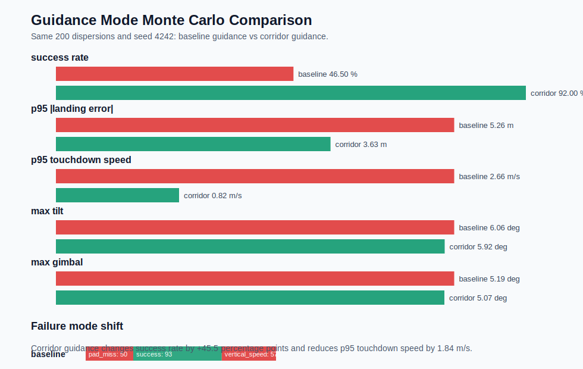
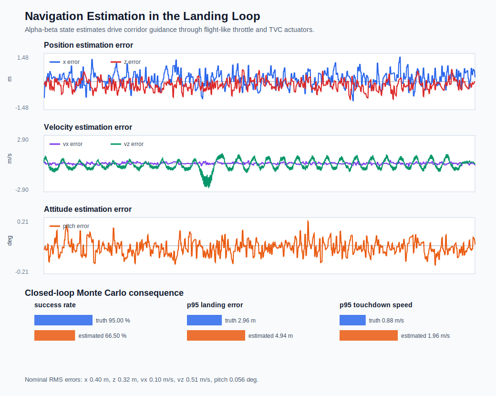
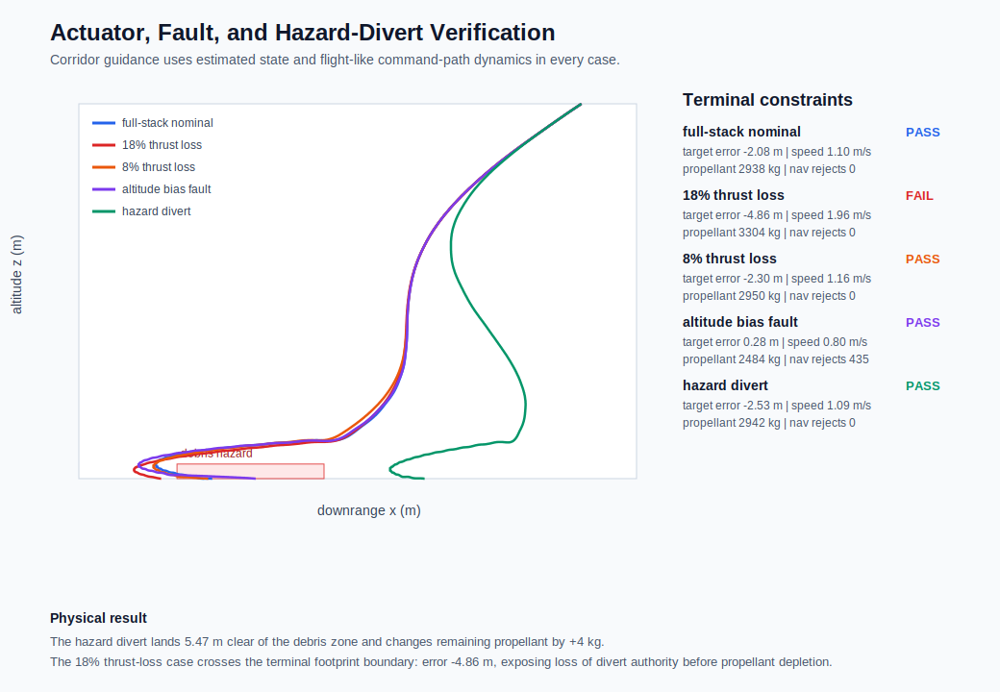
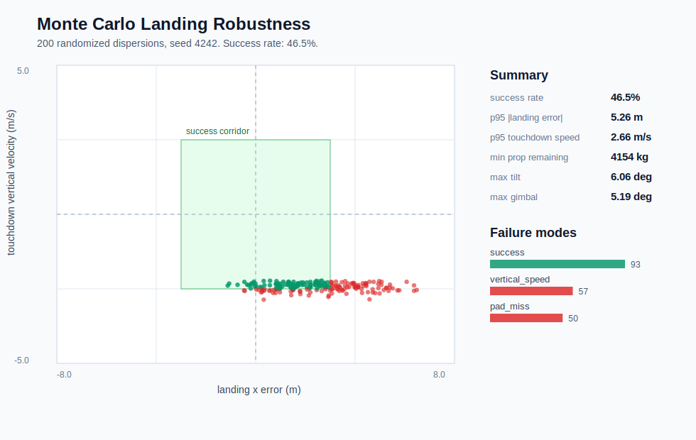

# Figure Index

Use this page for a fast technical review. Every figure is generated from committed simulator outputs.

## 1. Full-Stack Hazard-Relative Animation

**[Open the interactive landing animation](media/hazard_divert_landing_animation.html)**

The true and estimated trajectories separate because measurement bias, sample noise, and filter dynamics sit inside the feedback loop. The selected target is outside the debris interval, and the vehicle lands `5.47 m` from the nearest hazard edge. Early retargeting allows lateral impulse to accumulate before terminal tilt limits protect vertical braking.

## 2. Guidance Mode Comparison

Success rises from `46.5%` to `92.0%` on identical dispersions. The result comes from moving lateral correction earlier and reducing late tilt demand; maximum control deflection does not increase. This is temporal allocation of a coupled thrust vector, not simply higher gain.

## 3. Navigation Estimation Comparison

Truth-state feedback with finite actuators succeeds in `95.0%` of the 200 cases; estimated-state feedback succeeds in `66.5%`. The dominant new failure is target error. Estimator bias and lag perturb the lateral corridor, and the remaining error cannot always be removed after terminal tilt limits prioritize $T\cos\theta$.

## 4. Fault and Hazard Scenarios

The altitude-bias case survives after `435` rejected innovations but spends additional propellant through longer flight time. The thrust-loss case misses the pad with fuel remaining, identifying a finite-time control-authority boundary. The hazard case passes both target-relative and geometric-clearance requirements.

## 5. Divert Demand and Propellant

Successful target changes use nearly the same total propellant because the required body angles are small and the vertical projection penalty is approximately second order in tilt. The largest correction fails with positive propellant, demonstrating that fuel inventory is not equivalent to reachable lateral impulse.

## 6. Sampled Terminal-Condition Map

The grid tests 30 altitude/offset combinations with flight-like actuators. It is intentionally labeled as a sampled map: each altitude also changes initial descent energy, so nonmonotonic points reflect full-state and guidance-phase dependence rather than a geometric altitude rule.

## 7. Baseline Monte Carlo Dispersion

The original controller fails through both pad misses and vertical-speed violations while retaining substantial propellant. This figure establishes the failure distribution that motivates corridor guidance.

## 8. Nominal State History

Altitude, descent rate, lateral error, throttle, gimbal, and propellant show the initial closed-loop baseline. It remains useful as a controlled reference, but the later figures carry stronger robustness evidence.

## Supporting Analysis

- [Flight Physics](docs/flight_physics.md)
- [Navigation and State Estimation](docs/navigation_estimation.md)
- [Actuator Dynamics and Fault Response](docs/actuator_fault_response.md)
- [Hazard Divert and Landing Feasibility](docs/hazard_divert_feasibility.md)
- [Verification Matrix](VERIFICATION_MATRIX.md)
- [Complete Engineering Writeup](PORTFOLIO_WRITEUP.md)
