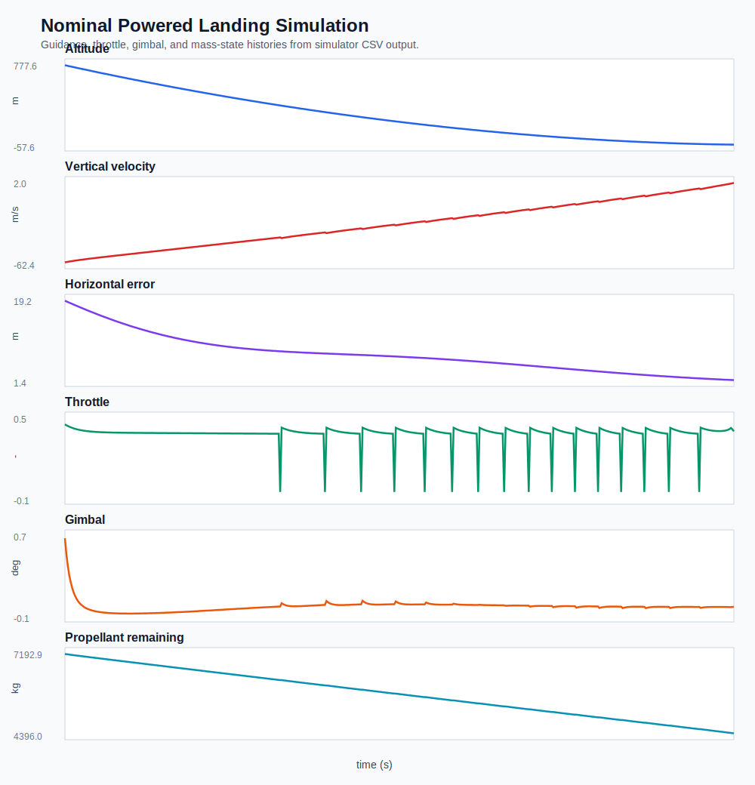

# Figure Index

Fast review guide for the autonomous landing GNC simulator.

## 1. Nominal Landing Summary

**What it shows:** Altitude, vertical velocity, horizontal error, throttle, gimbal angle, and propellant remaining during the nominal powered-descent simulation.

**Upper-division physical interpretation:** The vehicle must manage vertical energy while correcting horizontal error inside a finite acceleration envelope. Throttle controls vertical energy removal, body tilt creates lateral acceleration, gimbal torque regulates attitude, and mass depletion increases thrust-to-weight ratio later in the burn.

## 2. Landing Animation

[Browser-viewable nominal landing animation](media/nominal_landing_animation.html)

**What it shows:** Playback of the simulated descent trajectory with live altitude, crossrange, throttle, and gimbal readouts.

**Upper-division physical interpretation:** The animation makes the thrust-projection coupling visible: lateral correction requires body tilt, but tilt reduces the vertical thrust component available for braking. This is why powered landing is a constrained guidance problem rather than independent vertical and horizontal control.

## 3. Flight Physics Writeup

[Flight physics](docs/flight_physics.md)

**What it shows:** The equations, assumptions, known simplifications, and physical interpretation behind the baseline model.

**Upper-division physical interpretation:** The writeup connects trajectory results to `m x_ddot`, `m z_ddot`, mass depletion, drag, wind-relative velocity, TVC torque, and acceleration-command feasibility.

