# Figure Index

Use this page for a fast technical review. Every figure is generated from committed simulator outputs.

## 1. 6-DOF Nonlinear MPC Guidance Verification

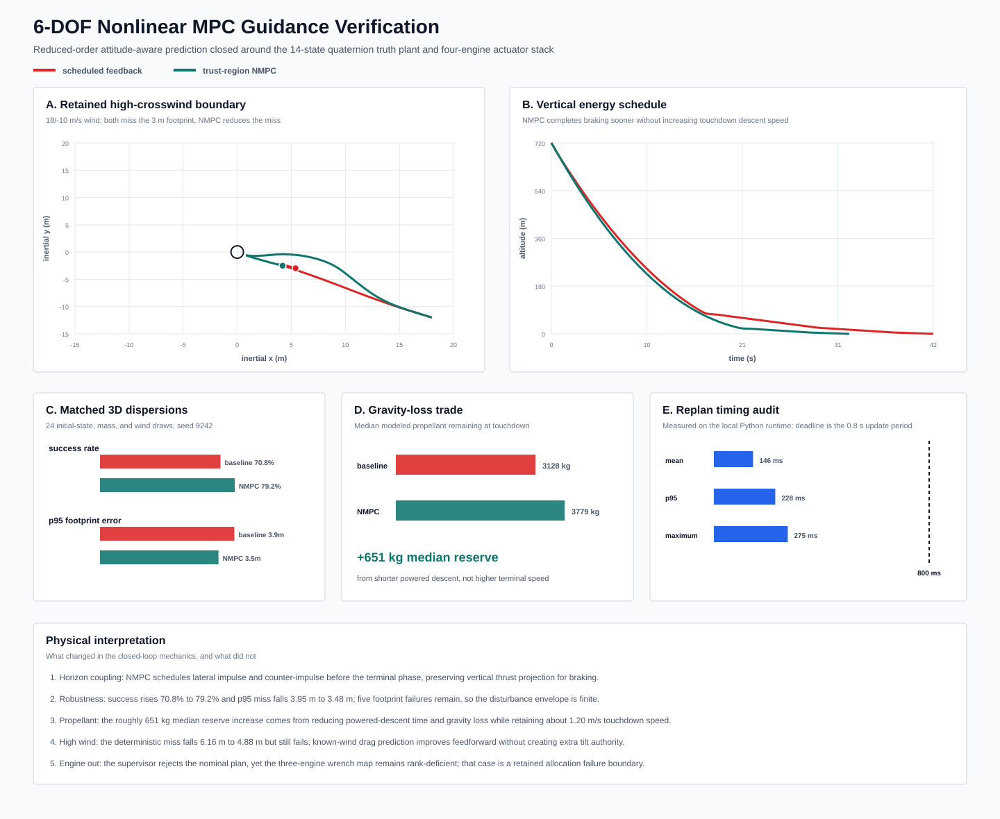

The upper plots connect guidance decisions to flight mechanics. In the
`18/-10 m/s` high-crosswind case, NMPC reduces terminal miss from `6.16 m` to
`4.88 m`, but both trajectories remain outside the `3 m` footprint. The
optimizer predicts known-wind drag and schedules the lateral counter-impulse
earlier; it does not create additional thrust-vector angle or time-to-go. The
retained failure therefore marks a finite disturbance/reachability boundary.

The altitude plot shows a shorter powered descent with nearly unchanged
vertical touchdown speed. Median modeled propellant remaining rises by
approximately `651 kg` because less time is spent producing force against
gravity. This is a gravity-loss reduction, not a trade for higher impact
energy.

The matched-seed 24-case comparison changes only guidance mode. Success rises
from `70.8%` to `79.2%`, median footprint error falls from `1.57 m` to
`1.26 m`, and p95 error falls from `3.95 m` to `3.48 m`. All remaining
failures are footprint misses. The result therefore improves lateral
robustness without shifting the dominant failure into vertical speed,
attitude, or propellant depletion.

Measured mean, p95, and maximum solve times are `146`, `228`, and `275 ms`
against an `800 ms` update period. This demonstrates local-runtime timing
margin but is not a flight-processor worst-case execution-time claim. See the
full [NMPC derivation and limitations](docs/six_dof_nmpc_guidance.md).

## 2. 3D 6-DOF Rigid-Body and Allocation Verification

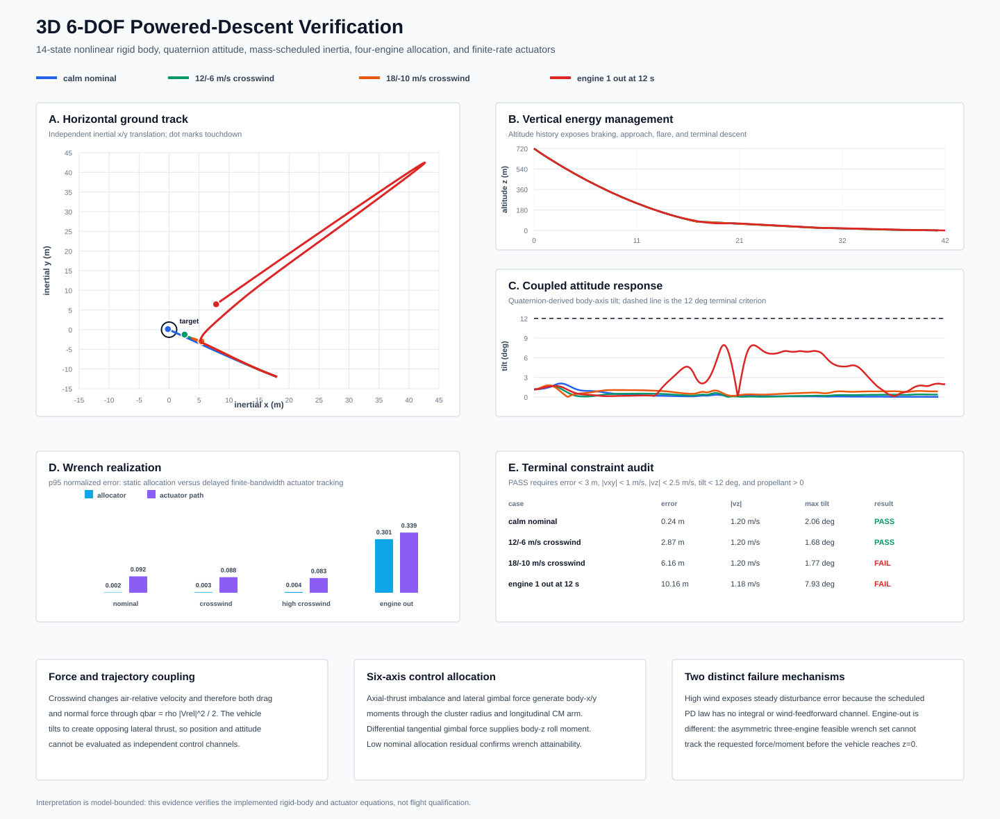

The ground-track panel proves that inertial `x` and `y` translation are
propagated independently. The altitude panel shows energy-based braking
followed by approach, flare, and terminal gates. The attitude panel is
computed from the propagated quaternion and remains below `12 deg` in every
case; a footprint failure is therefore not automatically an attitude failure.

The residual panel separates two questions. Static allocation asks whether the
requested six-axis wrench lies in the instantaneous four-engine feasible set.
Actuator tracking asks whether delayed, rate-limited engines realize that
wrench at the current instant. Passing cases have p95 static residual below
`0.005`; the engine-out case reaches `0.301`, exposing loss of attainable
wrench rather than only command-path lag.

The `18/-10 m/s` high-wind case and the engine-out case both miss the pad, but
for different reasons. High wind remains low-residual and low-tilt, indicating
steady disturbance error in a scheduled PD law without integral or wind
feedforward. Engine-out makes the feasible wrench set asymmetric and lands
`10.16 m` from target. See the
[interactive 3D flight](media/sixdof_landing_animation.html) or the
[GitHub-renderable preview](media/sixdof_landing_preview.gif).

## 3. Full-Stack Hazard-Relative Animation

**[Open the interactive landing animation](media/hazard_divert_landing_animation.html)**

Blue is the continuous integrated truth state; purple is the discrete navigation estimate supplied to guidance. The purple corrections are estimator innovations produced by noisy sampled measurements, not physical vehicle zigzags.

The green target is at `x = 12 m`, outside the `[-4, 4] m` debris interval. The S-shaped path is the expected geometry of a lateral impulse-and-brake maneuver. The first curvature builds lateral velocity through $a_x=T\sin\theta/m$; the second reverses lateral acceleration to remove that velocity before touchdown. As altitude decreases, corridor guidance reduces allowable tilt so $T\cos\theta$ is recovered for vertical-energy removal. The result is `2.53 m` target error, `1.09 m/s` touchdown speed, and `5.47 m` hazard clearance.

## 4. Constrained Predictive-Guidance Comparison

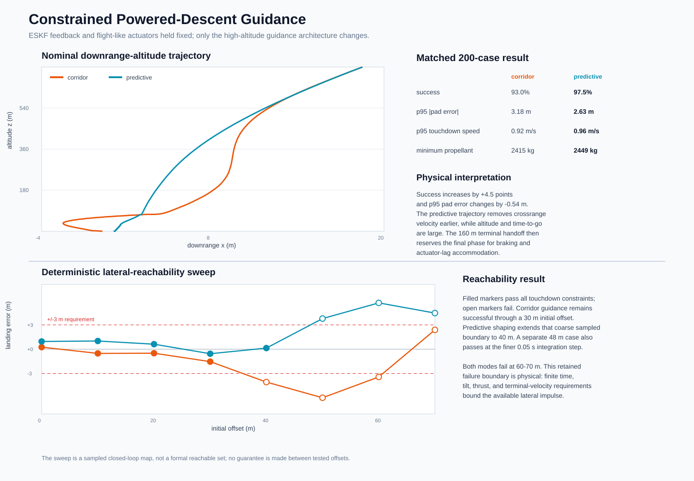

The ESKF, nonlinear plant, actuator model, 200 dispersions, and seed are
identical in both columns. Predictive guidance raises success from `93.0%` to
`97.5%`, reduces p95 absolute pad error by `0.54 m`, and raises p95 touchdown
speed by only `0.04 m/s`. The unchanged test conditions isolate guidance
architecture as the independent variable.

The optimized path removes lateral velocity earlier instead of carrying it
into terminal braking. Maximum tilt drops from `5.79 deg` to `4.41 deg`, and
maximum applied gimbal drops from `4.71 deg` to `2.07 deg`; improved footprint
performance therefore does not come from greater peak authority. It comes
from distributing lateral impulse over larger time-to-go while preserving
late vertical thrust projection.

The lower sweep is intentionally not presented as a formal reachable set.
Corridor guidance passes through `30 m` on the `10 m` grid, predictive
guidance through `40 m`, and both fail the tested `60-70 m` cases. A separate
`48 m` predictive case passes, but the `50 m` case fails, so the project makes
no monotonic interpolation claim between those samples.

## 5. Predictive Constraint Activity

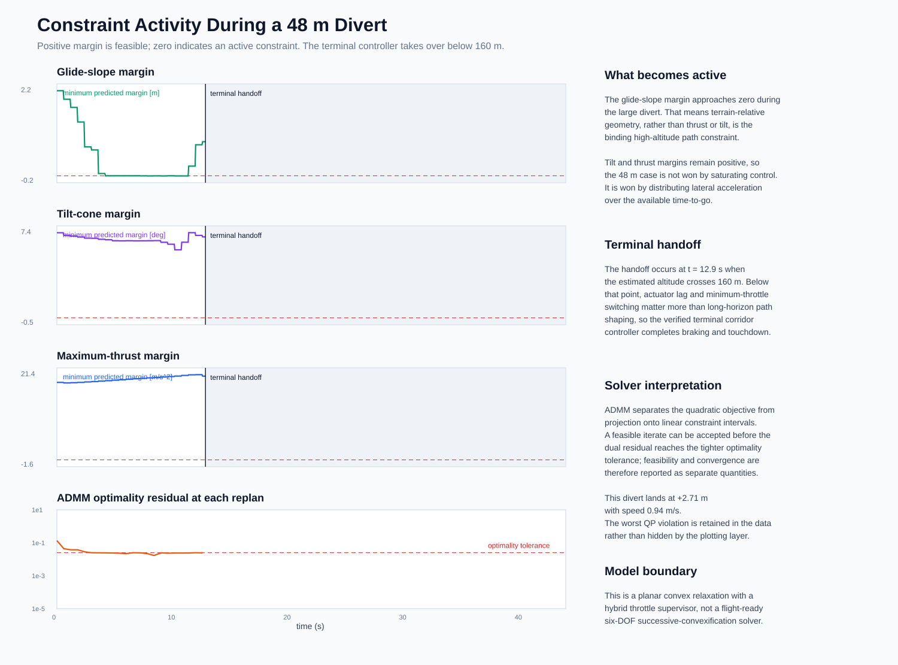

The `48 m` divert is a useful active-set experiment. Its glide-slope margin
approaches zero while tilt-cone and maximum-thrust margins remain positive.
This identifies terrain-relative path geometry as the binding constraint:
the optimizer must remove horizontal displacement early enough to satisfy the
shrinking corridor and still counter-accelerate before touchdown.

The shaded region begins at the `160 m` terminal handoff; optimizer margins
are not extrapolated after that point. The ADMM panel distinguishes strict
optimality convergence from feasible-plan acceptance. Across the 200-case
campaign, `99.90%` of plans are accepted, `74.22%` meet the tighter primal and
dual stopping tolerance, and four replans invoke corridor fallback. Rejected
iterate violations remain in the committed data.

## 6. Error-State EKF Consistency

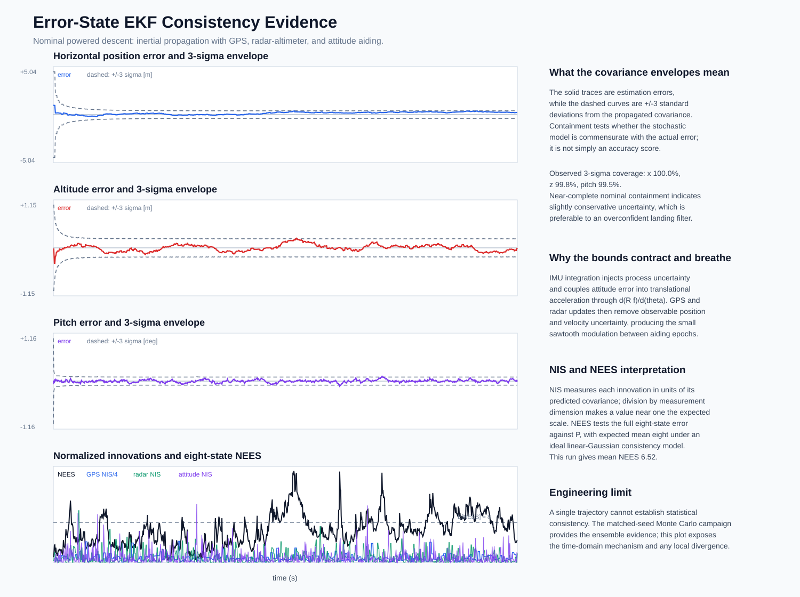

The state-error traces are plotted against the filter's own `+/-3 sigma` bounds. Between aiding epochs, IMU noise and bias random walks propagate through the state-transition matrix and expand uncertainty. GPS, radar, and attitude measurements contract the state directions they observe. The small covariance modulation is therefore the expected predictor-corrector cycle, not an oscillation of the physical vehicle.

The nominal mean NEES is `6.52` for eight estimated error states. Mean normalized NIS is near one for GPS (`0.95`), radar (`1.03`), and attitude (`0.97`). Three-sigma containment is at least `99.5%` for horizontal position, altitude, and pitch. The filter is slightly conservative in this nominal case; it is not falsely claiming millimeter accuracy through a collapsed covariance.

## 7. ESKF Architecture and Sensor Faults

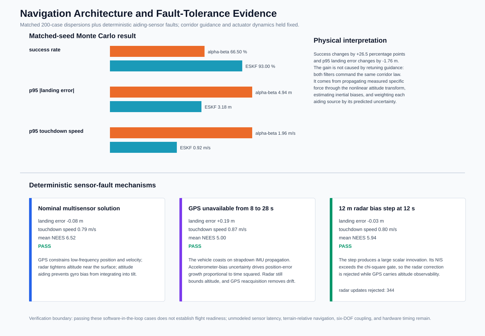

The matched-seed comparison changes only the navigation architecture. ESKF feedback raises success from `66.5%` to `93.0%`, lowers p95 landing error from `4.94 m` to `3.18 m`, and lowers p95 touchdown speed from `1.96 m/s` to `0.92 m/s`. Bias estimation and nonlinear specific-force propagation reduce the guidance error that otherwise survives the fixed-gain alpha-beta filter.

The deterministic cases expose the mechanism. A 20 s GPS outage increases horizontal drift because acceleration-bias uncertainty integrates twice into position, while radar and attitude aiding keep the vertical and rotational channels bounded. A `+12 m` radar step is rejected `344` times by the covariance-normalized scalar innovation gate, leaving GPS to carry altitude observability. Both cases pass, but only within the stated outage duration and sensor-noise assumptions.

## 8. Aiding-Sensor Fault Response

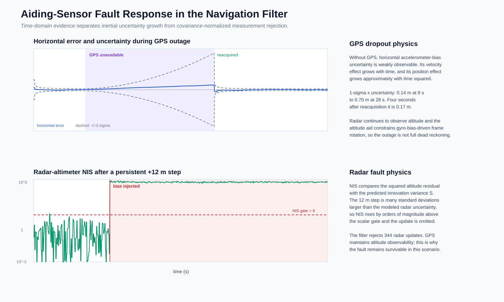

The GPS-outage panel shows why inertial dead reckoning is an uncertainty-growth problem. Horizontal `1 sigma` uncertainty expands from `0.14 m` at loss of GPS to `0.70 m` after 20 s because uncertain acceleration bias integrates into velocity and then position. GPS reacquisition contracts it to `0.17 m` within four seconds. Radar and attitude aiding remain active, so this is partial rather than total loss of observability.

The radar panel uses logarithmic NIS. Before the fault, scalar NIS remains near order one. The `+12 m` step drives the residual many standard deviations beyond the predicted innovation covariance, pushing NIS to order `10^3` above the gate at `9`. Rejecting `344` radar updates prevents the biased channel from contaminating guidance while GPS maintains altitude information.

## 9. Guidance Mode Comparison

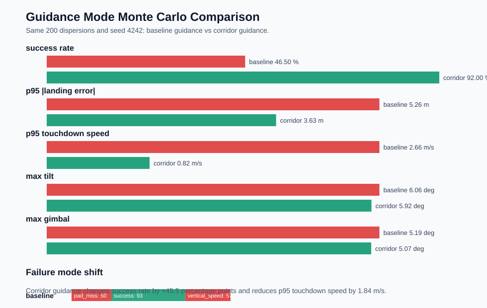

Success rises from `46.5%` to `92.0%` on identical dispersions. The p95 touchdown speed falls from `2.66 m/s` to `0.82 m/s`, while maximum tilt and gimbal both decrease slightly. This rules out increased control amplitude as the explanation.

The mechanism is altitude scheduling. Baseline guidance carries too much crossrange demand into the terminal phase, where tilting the vehicle reduces vertical thrust projection and competes with descent-rate control. Corridor guidance generates the lateral impulse earlier, when time-to-go is larger, then constrains late tilt. The shift from pad and vertical-speed failures to `184/200` successes is therefore a coupled energy-management and control-allocation result.

## 10. Alpha-Beta Navigation Estimation Comparison

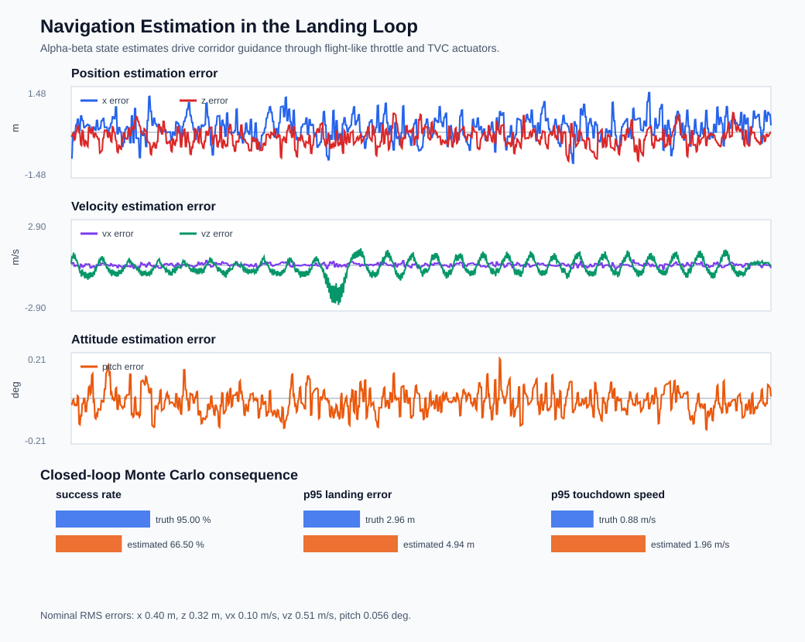

Truth-state feedback with finite actuators succeeds in `95.0%` of the 200 cases; estimated-state feedback succeeds in `66.5%`. The dominant new failure is target error. Estimator bias and lag perturb the lateral corridor, and the remaining error cannot always be removed after terminal tilt limits prioritize $T\cos\theta$.

## 11. Actuator Fault and Hazard Scenarios

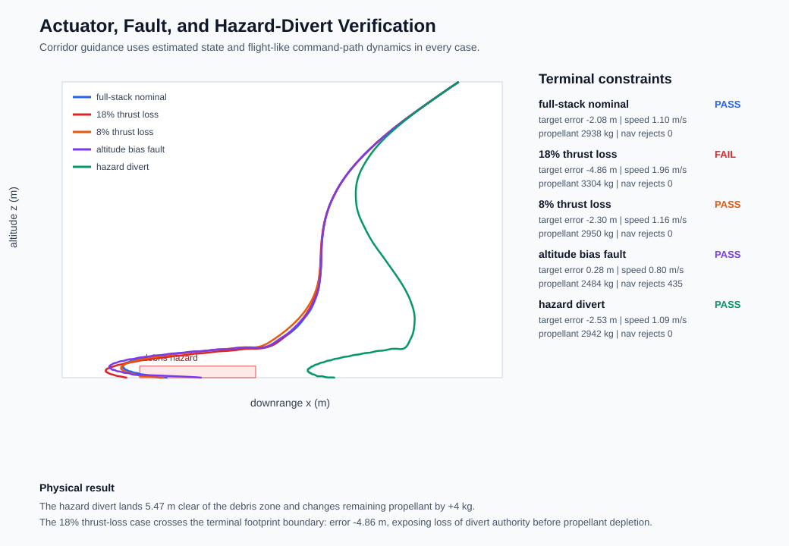

The trajectories initially overlap because their initial states, navigation realization, guidance law, and actuator model are identical. They diverge only after a fault changes delivered thrust or measured altitude, or after hazard logic selects a different target.

The `8%` thrust decrement remains recoverable; the `18%` decrement crosses the finite-time reachable-set boundary and lands `4.86 m` from target. Its `3304 kg` residual propellant is not contradictory: reduced delivered thrust also reduces mass flow, and the vehicle reaches the ground `4.80 s` before nominal. Fuel inventory is not equivalent to acceleration authority integrated over the remaining time-to-go.

The `+12 m` altitude step is rejected `435` times by innovation gating. The estimator remains bounded, but the descent extends to `50.55 s`, adding gravity loss and consuming about `454 kg` more propellant than nominal. The green hazard-divert path uses an early acceleration and later counter-acceleration to reach a safe site while suppressing touchdown lateral velocity.

## 12. Divert Demand and Propellant

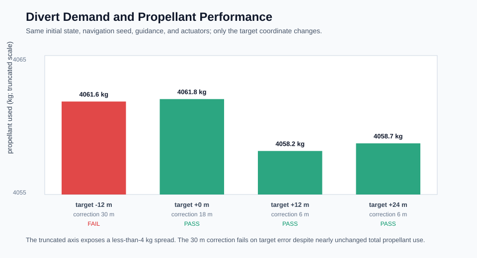

Successful target changes use nearly the same total propellant because the required body angles are small and the vertical projection penalty is approximately second order in tilt. The largest correction fails with positive propellant, demonstrating that fuel inventory is not equivalent to reachable lateral impulse.

## 13. Sampled Terminal-Condition Map

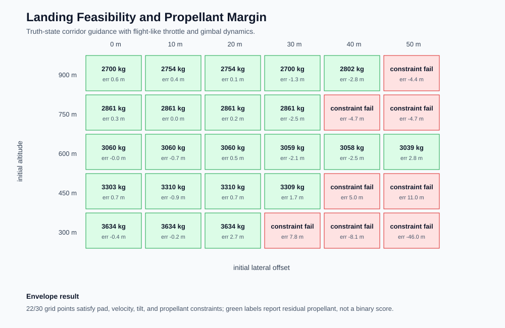

The grid tests 30 altitude/offset combinations with flight-like actuators. It is intentionally labeled as a sampled map: each altitude also changes initial descent energy, so nonmonotonic points reflect full-state and guidance-phase dependence rather than a geometric altitude rule.

## 14. Baseline Monte Carlo Dispersion

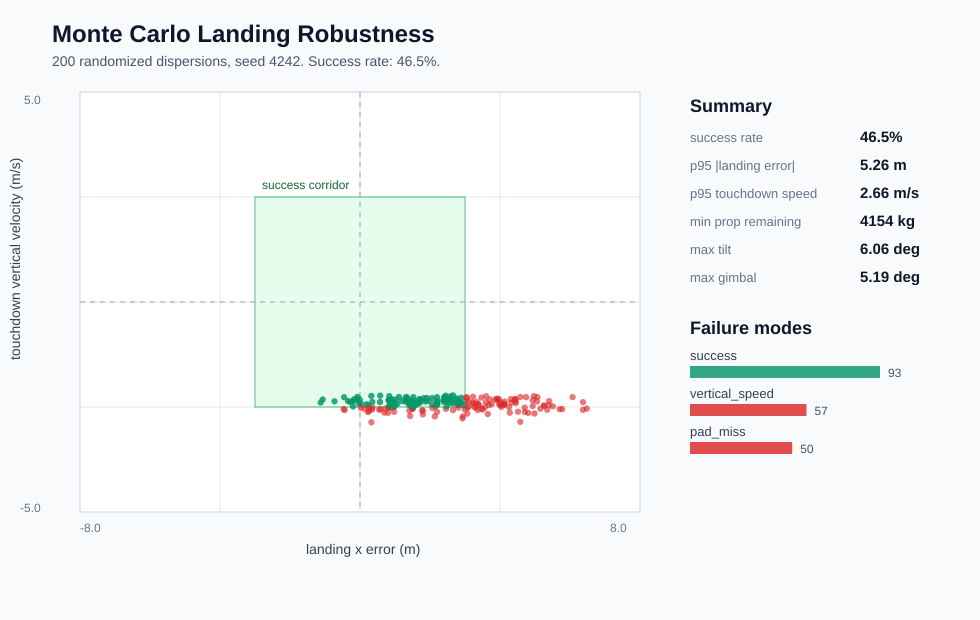

The original controller fails through both pad misses and vertical-speed violations while retaining substantial propellant. This figure establishes the failure distribution that motivates corridor guidance.

## 15. Nominal State History

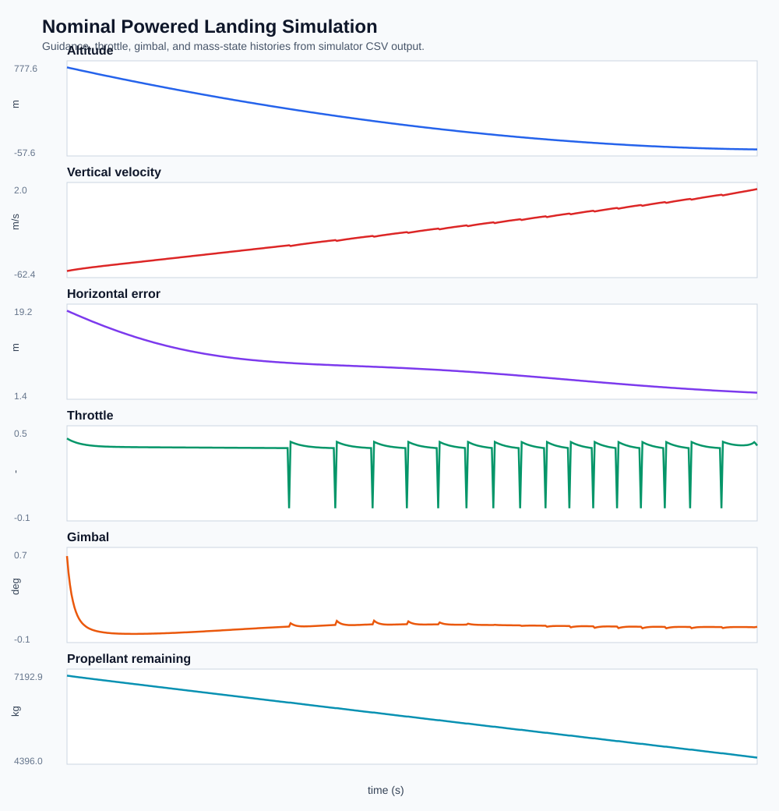

Altitude, descent rate, lateral error, throttle, gimbal, and propellant show the initial closed-loop baseline. It remains useful as a controlled reference, but the later figures carry stronger robustness evidence.

## Supporting Analysis

- [Flight Physics](docs/flight_physics.md)
- [3D 6-DOF Dynamics and Control](docs/six_dof_landing_dynamics_and_control.md)
- [Constrained Predictive Guidance](docs/constrained_predictive_guidance.md)
- [Alpha-Beta Navigation Baseline](docs/navigation_estimation.md)
- [Error-State EKF and Inertial Navigation](docs/error_state_ekf.md)
- [Actuator Dynamics and Fault Response](docs/actuator_fault_response.md)
- [Hazard Divert and Landing Feasibility](docs/hazard_divert_feasibility.md)
- [Verification Matrix](VERIFICATION_MATRIX.md)
- [Complete Engineering Writeup](PORTFOLIO_WRITEUP.md)
