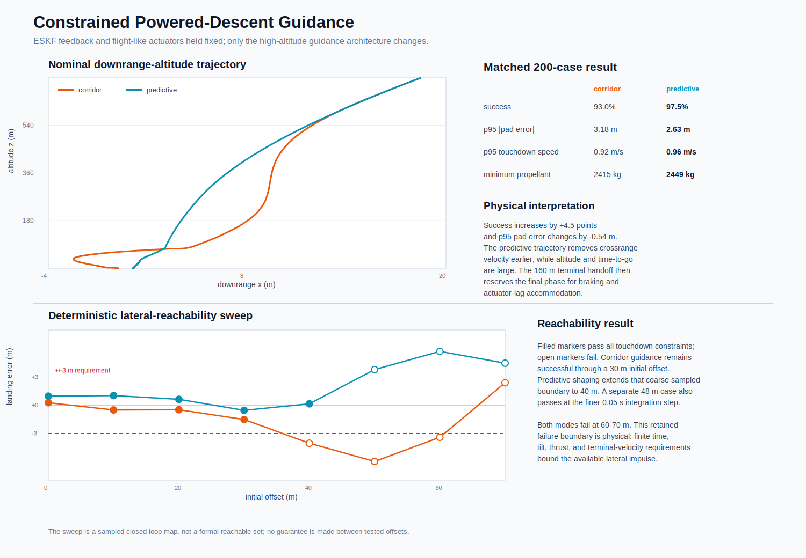
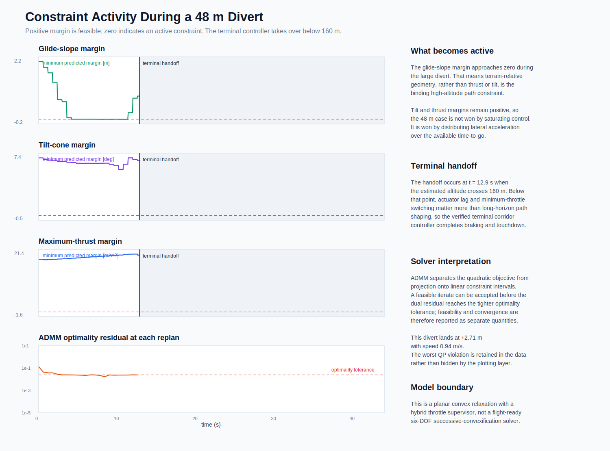

# Autonomous Powered-Descent GNC Simulator

A planar reusable-booster landing simulation that closes the loop through
IMU-driven error-state estimation, constrained predictive guidance, attitude
control, throttle/TVC actuator dynamics, fault injection, hazard-relative
targeting, and Monte Carlo verification.

## Start With the Flight

**[Open the interactive hazard-relative landing animation](media/hazard_divert_landing_animation.html)**

The animation is the quickest way to inspect the closed-loop sequence. Blue is the integrated vehicle truth state, purple is the navigation estimate used by guidance, orange is the applied thrust vector, red is the excluded debris interval, and green is the selected landing target.


### How to Read the Flight

The S-shaped ground track is a deliberate accelerate-and-brake maneuver, not controller wandering. The vehicle begins at `x = 18 m` and retargets to `x = 12 m` because the original `x = 0 m` site lies inside the modeled `[-4, 4] m` debris zone. Initial tilt generates lateral acceleration,

$$
a_x=\frac{T\sin\theta}{m},
$$

and accumulates the required lateral impulse while time-to-go is still large. The controller later reverses the sign of lateral acceleration to remove horizontal velocity before touchdown. This produces the second bend in the trajectory and prevents the vehicle from simply flying through the selected target.

The maneuver cannot be interpreted independently of vertical dynamics. The same thrust vector supplies both axes:

$$
a_z=\frac{T\cos\theta}{m}-g.
$$

Every lateral correction therefore reduces instantaneous vertical thrust projection. Corridor guidance schedules most crossrange correction at higher altitude, then contracts the allowable tilt as touchdown approaches so vertical kinetic-energy removal takes priority. The final near-vertical segment is the result of that control allocation.

The purple estimate is jagged because the estimator receives discrete noisy measurements and applies innovation corrections. Those jumps are not physical zigzags by the vehicle; the blue truth trajectory remains continuous under numerical integration. Navigation error matters because guidance acts on the estimate, so estimation bias becomes a commanded acceleration error before actuator lag and rate limits filter the response.

The verified hazard-divert case lands at `x = 9.47 m`, which is `2.53 m` short of the `12 m` target but inside the `|e_x| < 3 m` terminal corridor. Touchdown speed is `1.09 m/s`, lateral speed is `0.34 m/s`, and geometric clearance from the debris-zone edge is `5.47 m`.

## Engineering Result

The project begins with a nominal powered landing and then deliberately removes ideal assumptions. The final software path is:

```mermaid
flowchart LR
    ENV["Vehicle and environment truth"] --> SENS["Biased, noisy sensors"]
    SENS --> EST["IMU error-state EKF and aiding updates"]
    EST --> HAZ["Safe-target selection"]
    HAZ --> GUID["Constrained predictive guidance"]
    GUID --> TERM["160 m terminal handoff"]
    TERM --> CTRL["Attitude and TVC control"]
    CTRL --> ACT["Delay, lag, slew, deadband, saturation"]
    ACT --> DYN["Planar rigid-body dynamics"]
    DYN --> ENV
    DYN --> VER["Touchdown and robustness verification"]
```



Headline results:

| Verification case | Result | Interpretation |
| --- | ---: | --- |
| baseline guidance Monte Carlo | `46.5%` success | nominal tuning does not provide robust terminal margins |
| corridor guidance Monte Carlo | `92.0%` success | earlier lateral correction protects late vertical braking authority |
| corridor + actuators, truth feedback | `95.0%` success | finite actuator dynamics remain compatible with the guidance schedule |
| corridor + actuators, alpha-beta feedback | `66.5%` success | fixed-gain navigation error is the dominant robustness limitation |
| corridor + actuators, ESKF feedback | `93.0%` success | IMU propagation, bias estimation, and covariance-weighted aiding recover `26.5` points |
| predictive guidance + ESKF + actuators | `97.5%` success | constrained high-altitude impulse shaping reduces pad misses from `14` to `5` |
| deterministic `48 m` initial offset | pass | the glide-slope constraint becomes active while thrust and tilt retain margin |
| GPS unavailable from 8-28 s | pass | inertial covariance grows during the outage and contracts after reacquisition |
| +12 m radar-altimeter bias | pass | scalar NIS gating rejects `344` contaminated radar updates |
| +12 m altitude-bias fault | pass | innovation gating preserves touchdown with additional gravity loss |
| 8% delivered-thrust loss | pass | closed-loop margins absorb a moderate authority decrement |
| 18% delivered-thrust loss | fail | lateral footprint authority is lost before fuel is depleted |
| hazard-relative divert | pass | touchdown is `5.47 m` clear of the modeled debris edge |

These are simulation results under stated assumptions, not flight-vehicle performance claims.

## Flight Physics

The planar state is:

$$
\mathbf{x}=[x,\;z,\;v_x,\;v_z,\;\theta,\;\omega,\;m]^T
$$

Translation, pitch rotation, and mass depletion are modeled as:

$$
m\ddot x=T\sin\theta+D_x
$$

$$
m\ddot z=T\cos\theta+D_z-mg
$$

$$
I_y\dot\omega=TL\sin\delta-c_\omega\omega, \qquad
\dot m=-\frac{T}{I_{sp}g_0}
$$

The central coupling is thrust projection. Horizontal correction requires body tilt, but tilt reduces vertical thrust through $T\cos\theta$. Late divert commands can therefore improve pad alignment while consuming the acceleration margin needed to remove vertical kinetic energy. Corridor guidance addresses this by correcting crossrange earlier and reducing allowable tilt when terminal braking has priority.

The predictive upgrade makes that allocation explicit. A 12-node
direct-transcription problem selects future inertial accelerations subject to
a tilt cone, a conservative polygonal maximum-thrust bound, acceleration
slew, nonnegative altitude, and the terrain-relative corridor

$$
|x_k-x_{target}|\le 2.0+0.10z_k.
$$

The QP is resolved every `0.60 s` from the ESKF state. It governs the
high-altitude divert, then hands off below `160 m` because minimum-throttle
switching, actuator lag, and terminal braking dominate the low-altitude
dynamics. This is a planar convex relaxation with explicit fallback logic,
not a claim of flight-ready 6-DOF optimal guidance.

Navigation changes the problem from state feedback to output feedback:

$$
\mathbf{y}_k=\mathbf{h}(\mathbf{x}_k)+\mathbf{b}+\boldsymbol{\nu}_k
$$

The alpha-beta baseline predicts between common `0.10 s` measurement updates using fixed gains. The ESKF instead integrates body-frame specific force and gyro rate, estimates two accelerometer biases and one gyro bias, propagates an eight-state covariance, and applies asynchronous GPS, radar-altimeter, and attitude updates. Its error becomes a guidance error, which becomes an attitude command, which is filtered by actuator delay and slew limits before changing the true trajectory.

The complete derivation and result interpretation are in [Constrained Predictive Guidance](docs/constrained_predictive_guidance.md), [Flight Physics](docs/flight_physics.md), [Error-State EKF and Inertial Navigation](docs/error_state_ekf.md), [Alpha-Beta Navigation Baseline](docs/navigation_estimation.md), and [Actuator Dynamics and Fault Response](docs/actuator_fault_response.md).

## Visual Evidence

### Constrained Predictive Guidance



This comparison holds the ESKF, nonlinear plant, actuator stack, random
dispersions, and seed fixed. Replacing high-altitude corridor guidance with
receding-horizon acceleration planning raises success from `93.0%` to
`97.5%` and lowers p95 absolute pad error from `3.18 m` to `2.63 m`.
P95 touchdown speed increases slightly from `0.92 m/s` to `0.96 m/s`, still
well inside the `2.5 m/s` criterion. Reporting that trade is important: the
optimizer primarily improves lateral footprint robustness rather than every
scalar metric simultaneously.

The trajectory geometry explains the improvement. Predictive guidance removes
crossrange velocity while altitude and time-to-go remain large, so less
late-stage tilt is needed. Across the matched campaign, maximum body tilt
falls from `5.79 deg` to `4.41 deg` and maximum applied gimbal falls from
`4.71 deg` to `2.07 deg`. The gain therefore comes from when lateral impulse
is generated, not from increasing peak control authority.

The deterministic reachability sweep deliberately retains failures. Corridor
guidance passes the sampled grid through a `30 m` initial offset; predictive
guidance passes through `40 m`. A separately integrated `48 m` case passes,
while `50 m` fails the `3 m` footprint criterion. This nonmonotonic local
result is reported as a sampled closed-loop boundary, not interpolated into an
unsupported maximum-divert claim.

### Active Constraints and Numerical Evidence



In the verified `48 m` divert, the glide-slope margin approaches zero during
the high-altitude plan while tilt and maximum-thrust margins remain positive.
The active constraint is therefore the shrinking terrain-relative corridor,
which demands early removal of downrange error and later counter-acceleration
to suppress touchdown $v_x$. The trajectory is not produced by saturating
thrust or body angle.

The lower panel reports the ADMM residual at every replan. Strict optimality
convergence and physical feasibility are tracked separately: a finite-iteration
plan can satisfy every inequality before the dual residual reaches the tighter
stopping tolerance. Across 200 dispersed cases, mean plan acceptance is
`99.90%`, strict convergence is `74.22%`, and four replans use the verified
corridor fallback. The maximum recorded violation of `0.459` belongs to a
rejected iterate; it is preserved in the campaign output rather than hidden.

### Error-State Navigation Consistency


The solid traces are estimation errors; the dashed traces are the filter's propagated `+/-3 sigma` envelopes. IMU white noise and bias random walks expand covariance between aiding epochs, while GPS, radar, and attitude updates contract the observable state directions. The attitude Jacobian couples pitch uncertainty into translational acceleration because an error in the body-to-inertial rotation misprojects the measured specific-force vector.

The nominal mean NEES is `6.52` for an eight-state filter. Mean normalized NIS is `0.95` for GPS, `1.03` for radar, and `0.97` for attitude. Three-sigma coverage is `100.0%` in horizontal position, `99.8%` in altitude, and `99.5%` in pitch. Together these results indicate slightly conservative nominal covariance rather than an overconfident filter. A single trajectory is not an independent statistical ensemble, so the fixed-seed 200-case campaign supplies the stronger robustness evidence.

### Navigation Architecture and Sensor Faults


With guidance, actuators, dispersions, and seed held fixed, replacing the alpha-beta baseline with the ESKF raises success from `66.5%` to `93.0%`, reduces p95 absolute landing error from `4.94 m` to `3.18 m`, and reduces p95 touchdown speed from `1.96 m/s` to `0.92 m/s`. The mechanism is physical: body-frame specific force is rotated through the current attitude, inertial biases are estimated through repeated position/velocity aiding, and each correction is weighted by predicted uncertainty instead of a fixed gain.

During the 20 s GPS outage, horizontal accelerometer-bias uncertainty integrates into position uncertainty approximately with time squared. Radar continues to bound altitude and attitude aiding limits gyro-driven frame rotation; GPS reacquisition then contracts the horizontal covariance. The vehicle still lands at `0.19 m` target error. In the radar-bias case, a `+12 m` step produces NIS above the scalar gate, so `344` updates are rejected while GPS preserves altitude observability. Fault exclusion does not make the failed channel healthy; it prevents that channel from corrupting the guidance state.

This is a navigation-architecture comparison, not an algorithm-only A/B test on identical raw measurements. The alpha-beta baseline uses a common 10 Hz state-measurement packet; the ESKF uses a high-rate IMU and asynchronous aiding. Vehicle dispersions, guidance, control, actuators, terminal constraints, and campaign seed are held fixed.

### Aiding-Sensor Fault Mechanics


At GPS loss, horizontal `1 sigma` uncertainty is `0.14 m`; after 20 s of inertial propagation it reaches `0.70 m`. The curved covariance envelope reflects the double integration of acceleration-bias uncertainty. Four seconds after GPS returns, it has contracted to `0.17 m`. This is the expected information-flow signature of partial observability, not a manual reset.

The lower panel uses a logarithmic NIS axis because the radar step is orders of magnitude larger than the modeled innovation variance. Nominal scalar NIS fluctuates around order one. At `t = 12 s`, the persistent `+12 m` bias drives NIS to approximately `10^3`, well above the gate at `9`; radar corrections are omitted while the independent GPS channel continues to update altitude.

### Guidance Redesign


The same 200 initial-condition and model-parameter dispersions are applied to both guidance modes. Moving lateral correction earlier increases success from `46.5%` to `92.0%`, removes vertical-speed failures, and reduces p95 touchdown speed from `2.66 m/s` to `0.82 m/s`.

Peak tilt decreases from `6.06 deg` to `5.92 deg`, and peak gimbal decreases from `5.19 deg` to `5.07 deg`. The improvement therefore does not come from higher control amplitude. It comes from changing when the shared thrust vector is allocated laterally. Earlier crossrange impulse reduces the lateral acceleration still required at low altitude, allowing more of `T cos(theta)` to be reserved for vertical braking. The failure-mode shift is consequently a closed-loop energy-management result: corridor guidance trades early position correction for improved terminal velocity margin.

### Navigation in the Feedback Loop


The nominal estimator remains sub-meter in position RMS, but the estimated-state Monte Carlo produces 64 pad misses. The lateral corridor tightens with altitude, so small state errors that are recoverable early can become unrecoverable late once tilt is intentionally limited to preserve vertical thrust.

### Hazard Divert and Fault Response


All five cases use the same initial state, random seed, estimated-state feedback, corridor guidance, and flight-like throttle/TVC dynamics. Their early overlap is therefore expected. Curves separate only when delivered thrust changes, the altitude measurement is biased, or the target is moved.

The `8%` thrust-loss case remains inside the available acceleration/time-to-go margin and passes with `2.30 m` target error. The `18%` case reaches the ground `4.80 s` earlier than nominal and lands `4.86 m` from the target, outside the `3 m` corridor. It retains `3304 kg` because lower delivered thrust also reduces modeled mass flow and because ground contact occurs earlier. That residual fuel cannot retroactively supply the lateral and vertical impulse that the vehicle no longer has time or thrust authority to generate.

The `+12 m` altitude-bias step at `t = 7 s` produces `435` rejected measurement innovations. Innovation gating prevents the inconsistent measurement from directly displacing the estimated trajectory, but the disturbed estimate still lengthens the descent to `50.55 s`. The extra time under gravity raises propellant consumption by approximately `454 kg` relative to nominal. The vehicle nevertheless passes with `0.28 m` target error and `0.80 m/s` touchdown speed.

The green hazard-divert curve departs from the nominal family because it targets `x = 12 m` instead of `x = 0 m`. Its S-shape records the sign reversal in lateral acceleration: build crossrange impulse first, then counter-accelerate to reduce $v_x$. It lands `5.47 m` clear of the hazard while using nearly the same total propellant as nominal because the required tilt remains small; the vertical projection loss is approximately second order for small angles, since $\cos\theta \approx 1-\theta^2/2$.

### Sampled Feasibility


The 30-point grid maps success and residual propellant over initial altitude and lateral offset. The boundary is not strictly monotonic because altitude, initial vertical kinetic energy, guidance phase, actuator lag, and wind-relative drag all change together. It is a sampled closed-loop terminal-condition map, not a continuous reachability guarantee.

See [Figure Index](FIGURE_INDEX.md) for a plot-by-plot review and [Verification Matrix](VERIFICATION_MATRIX.md) for requirement traceability.

## Reproduce the Evidence

NumPy supports the ESKF matrix operations. Pillow is used only to regenerate the GitHub-renderable GIF preview.

```bash
python3 -m pip install -r requirements.txt
export PYTHONPATH="$PWD"
python3 scripts/run_nominal_landing.py
python3 scripts/plot_nominal_landing.py
python3 scripts/make_landing_animation.py
python3 scripts/run_monte_carlo.py --mode both
python3 scripts/plot_monte_carlo.py
python3 scripts/plot_guidance_comparison.py
python3 scripts/run_navigation_comparison.py
python3 scripts/plot_navigation_comparison.py
python3 scripts/run_ekf_campaign.py --cases 200 --seed 4242
python3 scripts/plot_ekf_campaign.py
python3 scripts/run_advanced_scenarios.py
python3 scripts/plot_advanced_scenarios.py
python3 scripts/run_predictive_guidance_campaign.py --cases 200 --seed 4242
python3 scripts/plot_predictive_guidance_campaign.py
python3 scripts/plot_propellant_performance.py
python3 scripts/make_advanced_landing_animation.py
python3 scripts/make_landing_gif.py
python3 scripts/run_feasibility_envelope.py
python3 scripts/plot_feasibility_envelope.py
python3 -m unittest discover tests
```

## Repository Map

```text
landing_gnc/   dynamics, constrained/corridor guidance, navigation, actuators, hazards
scripts/       reproducible campaigns, SVG plots, and HTML animation generators
docs/          equations, assumptions, physical interpretation, and limitations
outputs/       generated trajectory, Monte Carlo, fault, and feasibility data
figures/       recruiter-facing visual evidence generated from outputs
media/         browser-viewable animations and GitHub-renderable GIF preview
tests/         deterministic unit and system-level verification
```

## Model Boundaries

The simulator is intentionally planar and does not claim flight fidelity. It omits 6-DOF translation/rotation, a 15-state 3D inertial error model, slosh, flexible modes, multi-engine allocation, terrain-relative image processing, landing-leg contact, plume-ground interaction, and onboard timing/quantization. These omissions are recorded because engineering credibility depends on knowing what the model cannot establish.

The constrained predictor is deliberately an acceleration-space convex
relaxation. It does not propagate attitude, mass, or aerodynamics inside the
QP, and its exact minimum-throttle set is handled by a hybrid supervisor
rather than mixed-integer optimization. The strongest next technical
extension is 6-DOF successive convexification or nonlinear MPC with mass and
attitude states, trust regions, virtual controls, engine allocation, and
measured solver timing. Those additions would address the remaining pad
misses without pretending that another estimator label can remove a physical
reachability limit.
