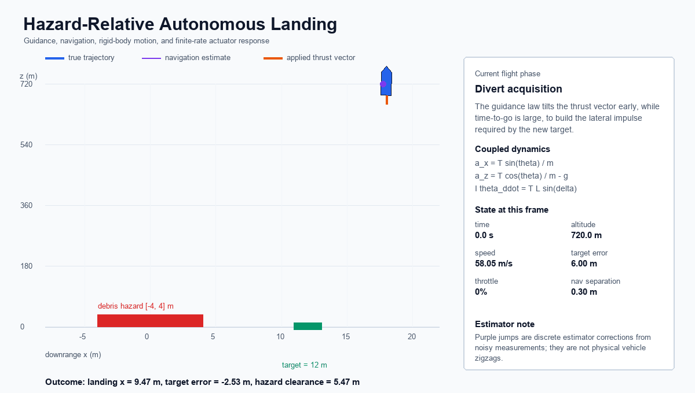

# Autonomous Powered-Descent GNC Simulator

A planar reusable-booster landing simulation that closes the loop through navigation, guidance, attitude control, throttle/TVC actuator dynamics, fault injection, hazard-relative targeting, and Monte Carlo verification.

## Start With the Flight

**[Open the interactive hazard-relative landing animation](media/hazard_divert_landing_animation.html)**

The animation overlays the vehicle's true trajectory and navigation estimate, marks the unsafe debris interval, identifies the selected safe target, and displays live target error, descent speed, throttle, and navigation separation.




## Engineering Result

The project begins with a nominal powered landing and then deliberately removes ideal assumptions. The final software path is:


Headline results:

| Verification case | Result | Interpretation |
| --- | ---: | --- |
| baseline guidance Monte Carlo | `46.5%` success | nominal tuning does not provide robust terminal margins |
| corridor guidance Monte Carlo | `92.0%` success | earlier lateral correction protects late vertical braking authority |
| corridor + actuators, truth feedback | `95.0%` success | finite actuator dynamics remain compatible with the guidance schedule |
| corridor + actuators, estimated feedback | `66.5%` success | navigation error is now the dominant robustness limitation |
| +12 m altitude-bias fault | pass | innovation gating preserves touchdown with additional gravity loss |
| 8% delivered-thrust loss | pass | closed-loop margins absorb a moderate authority decrement |
| 18% delivered-thrust loss | fail | lateral footprint authority is lost before fuel is depleted |
| hazard-relative divert | pass | touchdown is `5.47 m` clear of the modeled debris edge |

These are simulation results under stated assumptions, not flight-vehicle performance claims.

## Flight Physics

The planar state is:

$$
\mathbf{x}=[x,\;z,\;v_x,\;v_z,\;\theta,\;\omega,\;m]^T
$$

Translation, pitch rotation, and mass depletion are modeled as:

$$
m\ddot x=T\sin\theta+D_x
$$

$$
m\ddot z=T\cos\theta+D_z-mg
$$

$$
I_y\dot\omega=TL\sin\delta-c_\omega\omega, \qquad
\dot m=-\frac{T}{I_{sp}g_0}
$$

The central coupling is thrust projection. Horizontal correction requires body tilt, but tilt reduces vertical thrust through $T\cos\theta$. Late divert commands can therefore improve pad alignment while consuming the acceleration margin needed to remove vertical kinetic energy. Corridor guidance addresses this by correcting crossrange earlier and reducing allowable tilt when terminal braking has priority.

Navigation then changes the problem from state feedback to output feedback:

$$
\mathbf{y}_k=\mathbf{h}(\mathbf{x}_k)+\mathbf{b}+\boldsymbol{\nu}_k
$$

The estimator predicts between `0.10 s` measurement updates and applies innovation-gated corrections. Its error becomes a guidance error, which becomes an attitude command, which is filtered by actuator delay and slew limits before changing the true trajectory. The resulting 28.5-point Monte Carlo success-rate reduction is therefore a closed-loop systems result, not a plotting artifact.

The complete derivation and result interpretation are in [Flight Physics](docs/flight_physics.md), [Navigation and State Estimation](docs/navigation_estimation.md), and [Actuator Dynamics and Fault Response](docs/actuator_fault_response.md).

## Visual Evidence

### Guidance Redesign


The same 200 dispersions are applied to both guidance modes. Moving lateral correction earlier increases success from `46.5%` to `92.0%`, removes vertical-speed failures, and reduces p95 touchdown speed from `2.66 m/s` to `0.82 m/s`. Because maximum tilt and gimbal do not increase, the improvement comes from better temporal allocation of control authority rather than more aggressive actuator use.

### Navigation in the Feedback Loop


The nominal estimator remains sub-meter in position RMS, but the estimated-state Monte Carlo produces 64 pad misses. The lateral corridor tightens with altitude, so small state errors that are recoverable early can become unrecoverable late once tilt is intentionally limited to preserve vertical thrust.

### Hazard Divert and Fault Response


The altitude-bias fault is survived because the estimator rejects innovations inconsistent with its predicted trajectory, but the additional flight time consumes about `454 kg` more propellant than the full-stack nominal case. The thrust-loss case retains `3304 kg` yet misses the pad, proving that stored propellant and usable time-constrained acceleration authority are not equivalent.

### Sampled Feasibility


The 30-point grid maps success and residual propellant over initial altitude and lateral offset. The boundary is not strictly monotonic because altitude, initial vertical kinetic energy, guidance phase, actuator lag, and wind-relative drag all change together. It is a sampled closed-loop terminal-condition map, not a continuous reachability guarantee.

See [Figure Index](FIGURE_INDEX.md) for a plot-by-plot review and [Verification Matrix](VERIFICATION_MATRIX.md) for requirement traceability.

## Reproduce the Evidence

The simulator and SVG pipeline use the Python standard library. Pillow is used only to regenerate the GitHub-renderable GIF preview.

```bash
python3 scripts/run_nominal_landing.py
python3 scripts/plot_nominal_landing.py
python3 scripts/make_landing_animation.py
python3 scripts/run_monte_carlo.py --mode both
python3 scripts/plot_monte_carlo.py
python3 scripts/plot_guidance_comparison.py
python3 scripts/run_navigation_comparison.py
python3 scripts/plot_navigation_comparison.py
python3 scripts/run_advanced_scenarios.py
python3 scripts/plot_advanced_scenarios.py
python3 scripts/plot_propellant_performance.py
python3 scripts/make_advanced_landing_animation.py
python3 scripts/make_landing_gif.py
python3 scripts/run_feasibility_envelope.py
python3 scripts/plot_feasibility_envelope.py
python3 -m unittest discover tests
```

## Repository Map

```text
landing_gnc/   dynamics, guidance, navigation, actuators, hazards, experiments
scripts/       reproducible campaigns, SVG plots, and HTML animation generators
docs/          equations, assumptions, physical interpretation, and limitations
outputs/       generated trajectory, Monte Carlo, fault, and feasibility data
figures/       recruiter-facing visual evidence generated from outputs
media/         browser-viewable animations and GitHub-renderable GIF preview
tests/         deterministic unit and system-level verification
```

## Model Boundaries

The simulator is intentionally planar and does not claim flight fidelity. It omits 6-DOF translation/rotation, slosh, flexible modes, multi-engine allocation, terrain-relative image processing, landing-leg contact, plume-ground interaction, covariance-based navigation, and onboard timing/quantization. These omissions are recorded because engineering credibility depends on knowing what the model cannot establish.

The strongest next technical extension is an error-state EKF with IMU propagation, followed by constrained trajectory optimization or MPC. The current alpha-beta estimator provides the baseline needed to quantify whether those additions improve terminal constraints rather than merely adding algorithmic complexity.
