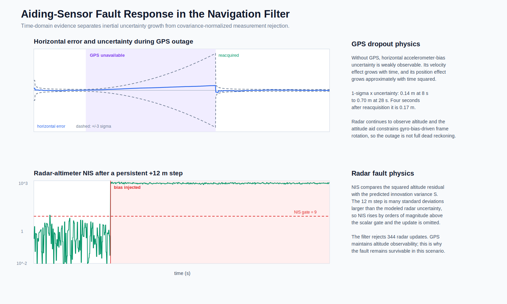
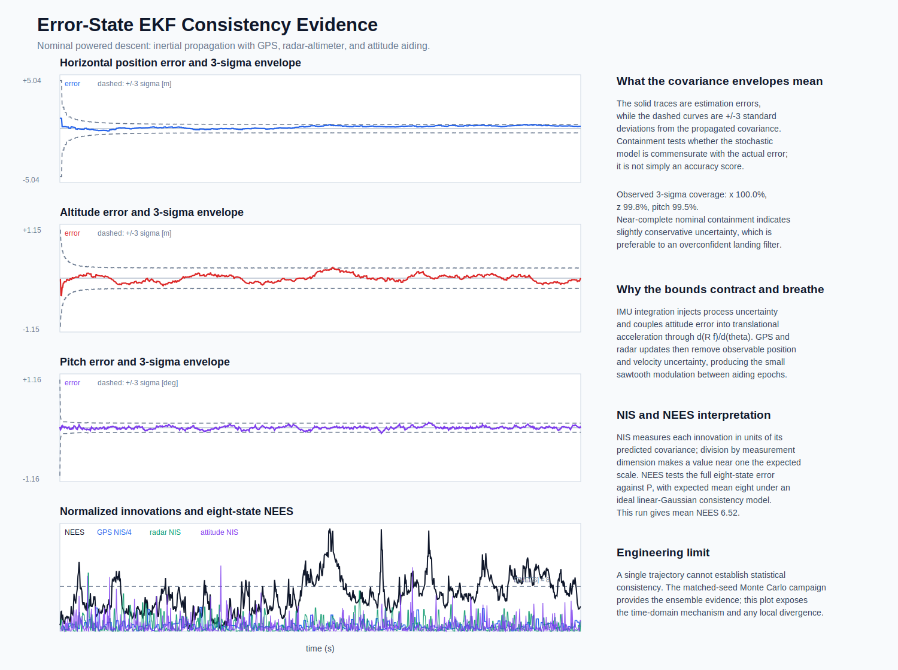
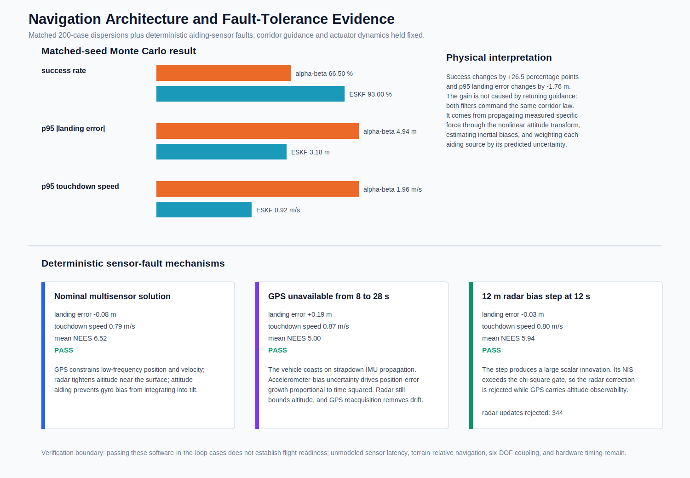

# Error-State EKF and Inertial Navigation

## Engineering Objective

The alpha-beta estimator establishes that navigation error can dominate landing performance, but it does not model vehicle acceleration, sensor bias states, or uncertainty. This phase replaces that baseline with an eight-state planar error-state extended Kalman filter (ESKF):

$$
\hat{\mathbf{x}}=
\begin{bmatrix}
\hat x & \hat z & \hat v_x & \hat v_z & \hat\theta &
\hat b_{a_x} & \hat b_{a_z} & \hat b_g
\end{bmatrix}^T .
$$

The nominal state is propagated nonlinearly with the IMU. A local linear error state and covariance are propagated about that trajectory, then discrete GPS, radar-altimeter, and attitude measurements inject corrections. Guidance still acts on the estimated position, velocity, attitude, and rate, so estimator behavior is evaluated by touchdown constraints as well as state error.

## Frames and Specific Force

The inertial frame uses downrange $x$ and altitude $z$. Pitch $\theta$ is measured from vertical, positive when the body thrust axis tips toward positive downrange. The body-to-inertial rotation is:

$$
\mathbf{R}_{IB}(\theta)=
\begin{bmatrix}
\cos\theta & \sin\theta\\
-\sin\theta & \cos\theta
\end{bmatrix}.
$$

An accelerometer does not measure inertial acceleration directly. It measures specific force:

$$
\mathbf{f}_B=\mathbf{R}_{IB}^T
\left(
\begin{bmatrix}\ddot x\\\ddot z\end{bmatrix}
+\begin{bmatrix}0\\g\end{bmatrix}
\right)
+\mathbf{b}_a+\mathbf{n}_a .
$$

Consequently, a level vehicle hovering at zero inertial acceleration reads approximately $+g$ on its body vertical accelerometer. A freely falling vehicle reads approximately zero in the ideal model. Treating accelerometer output as $\ddot{\mathbf r}$ would double-count gravity and cause immediate vertical divergence.

The gyro measurement is:

$$
\omega_m=\dot\theta+b_g+n_g .
$$

Both accelerometer and gyro biases are initialized as random constants and then driven by random walks. White sample noise and bias drift are separated because they produce different navigation-error growth: white acceleration noise produces a random-walk velocity error, while a constant acceleration bias produces velocity error proportional to time and position error proportional to time squared.

## Nonlinear Strapdown Propagation

After subtracting the current bias estimates,

$$
\hat{\mathbf f}_B=\mathbf f_m-\hat{\mathbf b}_a,\qquad
\hat\omega=\omega_m-\hat b_g,
$$

the nominal state propagates as:

$$
\dot{\hat{\mathbf r}}=\hat{\mathbf v},
$$

$$
\dot{\hat{\mathbf v}}=
\mathbf R_{IB}(\hat\theta)\hat{\mathbf f}_B
+\begin{bmatrix}0\\-g\end{bmatrix},
$$

$$
\dot{\hat\theta}=\hat\omega,\qquad
\dot{\hat{\mathbf b}}_a=\mathbf 0,\qquad
\dot{\hat b}_g=0.
$$

The simulator evaluates the attitude transform at the interval midpoint. This reduces the integration error that would result from rotating the full specific-force sample with only the beginning-of-step attitude.

## Error Dynamics and Covariance

Let $\delta\mathbf{x}$ be the local error about the nominal state. The important linearized couplings are:

$$
\delta\dot{\mathbf r}=\delta\mathbf v,
$$

$$
\delta\dot{\mathbf v}
=
\frac{\partial(\mathbf R_{IB}\mathbf f_B)}{\partial\theta}
\delta\theta
-\mathbf R_{IB}\delta\mathbf b_a
+\mathbf R_{IB}\mathbf n_a,
$$

$$
\delta\dot\theta=-\delta b_g+n_g.
$$

The attitude-to-acceleration Jacobian is physically important. A pitch error rotates the estimated specific-force vector, so an attitude error becomes a translational acceleration error even when the accelerometer itself is perfect. During powered flight, large axial specific force makes this coupling stronger.

Using the continuous linearized matrices $\mathbf F$ and $\mathbf G$, the implementation forms:

$$
\mathbf\Phi \approx
\mathbf I+\mathbf F\Delta t+\frac{1}{2}\mathbf F^2\Delta t^2
$$

and propagates:

$$
\mathbf P^-_{k+1}
=
\mathbf\Phi\mathbf P^+_k\mathbf\Phi^T
+\mathbf G\mathbf Q_c\mathbf G^T\Delta t.
$$

$\mathbf Q_c$ includes accelerometer and gyro white-noise densities plus accelerometer- and gyro-bias random walks. The covariance therefore grows between aiding updates, particularly during GPS dropout, rather than remaining artificially fixed.

## Asynchronous Aiding Updates

The simulated aiding architecture is:

| Sensor | Rate | Measurement |
| --- | ---: | --- |
| IMU | integration rate | body specific force and pitch rate |
| GPS | `5 Hz` | $x,z,v_x,v_z$ |
| radar altimeter | `10 Hz` | $z$ |
| independent attitude aid | `20 Hz` | $\theta$ |

Each update uses:

$$
\mathbf r_k=\mathbf y_k-\mathbf h(\hat{\mathbf x}^-_k),
$$

$$
\mathbf S_k=\mathbf H_k\mathbf P^-_k\mathbf H_k^T+\mathbf R_k,
$$

$$
\mathbf K_k=\mathbf P^-_k\mathbf H_k^T\mathbf S_k^{-1}.
$$

The covariance correction uses the Joseph form:

$$
\mathbf P^+ =
(\mathbf I-\mathbf K\mathbf H)\mathbf P^-(\mathbf I-\mathbf K\mathbf H)^T
+\mathbf K\mathbf R\mathbf K^T.
$$

The Joseph form is algebraically equivalent to the simplified covariance update under exact arithmetic, but it better preserves symmetry and positive semidefiniteness under finite precision.

## Innovation Gating and Fault Isolation

The normalized innovation squared (NIS) is:

$$
\epsilon_{\nu,k}=\mathbf r_k^T\mathbf S_k^{-1}\mathbf r_k.
$$

Because it scales the residual by predicted uncertainty, NIS is more defensible than a fixed residual threshold. The GPS update uses a four-degree-of-freedom gate; radar and attitude use scalar gates. A measurement outside its gate is omitted for that epoch while other sensors continue updating.

In the `+12 m` radar-bias case, `344` radar updates are rejected. GPS preserves altitude observability and the vehicle still lands with `0.03 m` target error and `0.80 m/s` touchdown speed. This is fault exclusion, not fault correction: the filter does not estimate the radar step. If GPS were simultaneously unavailable, rejecting radar would leave vertical position supported mainly by inertial propagation and would consume substantially more uncertainty margin.

## Observability

The accelerometer biases are not measured directly. They become observable through their integrated effect on velocity and position when GPS and radar measurements repeatedly constrain those states. Gyro bias becomes observable because attitude aiding constrains the angle that gyro integration would otherwise drift.

During GPS dropout from `8 s` to `28 s`:

- horizontal position and velocity rely on IMU propagation;
- radar continues to constrain altitude but does not observe horizontal acceleration bias;
- attitude aiding prevents gyro bias from rotating the acceleration frame without bound;
- horizontal position covariance expands because acceleration-bias uncertainty integrates twice;
- GPS reacquisition produces a covariance-weighted correction and contracts the horizontal uncertainty.

The deterministic dropout case increases horizontal RMS estimation error from `0.20 m` to `0.85 m`, yet lands with `0.19 m` target error. That result depends on the finite dropout duration and the stated bias model; it is not a guarantee for arbitrary outages.

## Consistency Evidence

For an $n$-state statistically consistent linear-Gaussian estimator, the expected NEES scale is $n$. This filter has eight error states, and the nominal run gives mean NEES `6.52`. The GPS mean normalized NIS is `0.95`, radar NIS is `1.03`, and attitude NIS is `0.97`. Nominal three-sigma coverage is `100.0%` in horizontal position, `99.8%` in altitude, and `99.5%` in pitch.

These values indicate a slightly conservative nominal covariance model. They do not prove exact consistency: one trajectory is strongly time-correlated, and repeated samples are not an independent ensemble. The 200-case campaign provides the stronger aggregate check, where mean case NEES is `5.67` and mean normalized NIS remains close to one for all three aiding channels.

## Closed-Loop Monte Carlo Consequence

The alpha-beta baseline and ESKF use identical 200-case vehicle, atmosphere, wind, and initial-state dispersions. Guidance, attitude control, actuator dynamics, touchdown limits, and random seed are fixed.

The comparison is at navigation-architecture level rather than an algorithm-only replay of identical measurements. The alpha-beta baseline receives a common 10 Hz state-measurement packet; the ESKF receives a high-rate IMU with asynchronous GPS, radar, and attitude aiding. This distinction is explicit because filter structure and sensor timing cannot be separated in an inertial-navigation architecture.

| Metric | Alpha-beta | ESKF | Change |
| --- | ---: | ---: | ---: |
| success rate | `66.5%` | `93.0%` | `+26.5 points` |
| p95 absolute landing error | `4.94 m` | `3.18 m` | `-1.76 m` |
| p95 touchdown speed | `1.96 m/s` | `0.92 m/s` | `-1.04 m/s` |

The result is not merely "the EKF is more accurate." The ESKF propagates the measured acceleration vector through the nonlinear attitude transformation and estimates slowly varying inertial biases. Its covariance weights asynchronous sensors according to uncertainty and prevents a high-confidence outlier from entering guidance. The reduction in terminal velocity and pad misses is the closed-loop consequence of those navigation improvements.

Fourteen ESKF cases still miss the pad. The p95 error of `3.18 m` lies slightly outside the strict `3 m` requirement, so the navigation upgrade does not eliminate the lateral reachability boundary. This retained failure population is important evidence: the filter improves state knowledge, but it cannot create thrust authority or time-to-go.

## Model Boundary

This is a planar software-in-the-loop navigation model. It does not include:

- a 15-state three-dimensional inertial error model;
- Earth rotation, transport rate, geodetic coordinates, or gravity variation;
- sensor scale factors, axis misalignment, vibration rectification, or timestamp jitter;
- GPS pseudorange processing or terrain-relative image navigation;
- radar beam geometry, slant-range effects, or terrain slope;
- sensor correlation, delayed/out-of-sequence updates, or federated fault management;
- hardware timing, quantization, and processor load.

The appropriate next navigation fidelity step would be a 15-state 3D ESKF driven by asynchronous timestamped sensor packets. The next project-level GNC step is constrained trajectory optimization or MPC, because the remaining failures are increasingly tied to finite control authority rather than estimator divergence.
