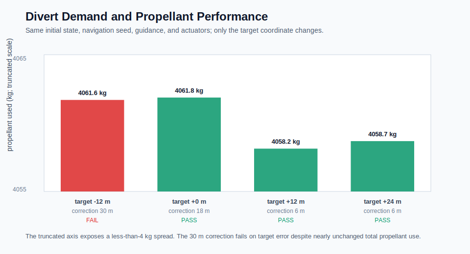
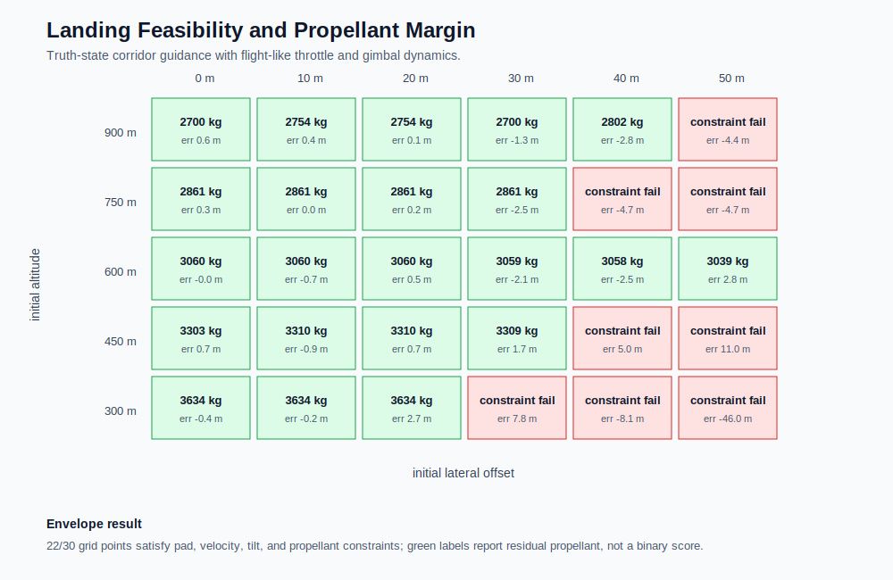

# Hazard Divert and Landing Feasibility

## Hazard-Relative Targeting

The landing surface contains a debris interval from `x = -4 m` to `x = +4 m`. Candidate targets are filtered by required geometric clearance, and the nearest reachable candidate to the current vehicle position is selected. For the deterministic case, the target moves from `0 m` to `+12 m`.

The target selector is deliberately separate from the continuous guidance law:

```text
hazard map -> discrete safe target -> continuous corridor guidance -> attitude/TVC control
```

This separation makes the assumptions auditable. The hazard layer decides *where* to land; the guidance layer decides *how* to move the state toward that target.

## Hazard-Divert Result

[Open the hazard-relative landing animation](../media/hazard_divert_landing_animation.html)

The vehicle touches down at `x = 9.47 m`, giving `5.47 m` clearance from the nearest debris edge. Its target-relative error is `-2.53 m`, touchdown speed is `1.09 m/s`, and modeled propellant remaining is `2942 kg`.

The maneuver works because the target is selected early. Lateral acceleration is accumulated while substantial altitude and time-to-go remain. Near touchdown, the corridor guidance law reduces allowed tilt so vertical braking retains priority through the $T\cos\theta$ projection.

## Divert Demand and Propellant



The target sweep holds initial state, navigation seed, controller, and actuators fixed. Required lateral corrections range from `6 m` to `30 m`.

The successful cases use approximately `4058-4062 kg` of propellant even though target geometry changes. At the small angles used here, the vertical-thrust penalty is second order:

$$
T\cos\theta \approx T\left(1-\frac{\theta^2}{2}\right)
$$

Therefore moderate lateral corrections can change terminal position without dramatically changing total burn impulse. The `30 m` correction fails the pad constraint while retaining propellant. This demonstrates that propellant mass alone is an incomplete feasibility metric; time-to-go, tilt scheduling, and lateral acceleration authority can become active first.

## Sampled Terminal-Condition Map



The grid evaluates `30` combinations of initial altitude and horizontal offset with flight-like actuators. `22` satisfy all touchdown constraints.

Each initial altitude is paired with a descent speed based on a stopping-distance scale:

$$
|v_{z,0}| = \min\left(58,\;0.94\sqrt{2a_b z_0}\right)
$$

The map is therefore a sampled terminal-condition study, not a continuous reachability proof. Its rows do not differ in altitude alone; they also differ in initial vertical kinetic energy.

## Why the Boundary Is Not Strictly Monotonic

More altitude usually provides more correction time, but it can also enter the controller with greater descent speed and incur more gravity loss. Actuator lag, minimum-throttle logic, wind-relative drag, and altitude-scheduled tilt limits change when the trajectory enters each guidance phase. As a result, a nearby grid point can fail while another with a different altitude-energy combination succeeds.

That nonmonotonicity should not be smoothed away. It indicates that the closed-loop feasible set depends on the full state $[x,z,v_x,v_z,\theta,\omega,m]$, not only on geometric altitude and offset.

## Relevance to Flight Design

A flight implementation would replace candidate selection with terrain-relative navigation, hazard-map uncertainty, reachable-set screening, and trajectory optimization. The current result establishes the correct analysis chain:

1. represent unsafe geometry explicitly;
2. enforce clearance during target selection;
3. run the chosen target through the same navigation, guidance, control, and actuator stack;
4. verify terminal constraints and propellant margin;
5. report where the sampled feasible boundary fails.
